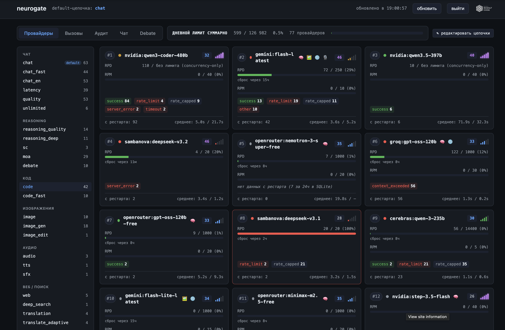

# neurogate

[](LICENSE)


**Бесплатный OpenAI-совместимый API на основе фоллбэка между ~20 free-провайдерами LLM.** Self-hosted, $0/мес, drop-in замена для любого OpenAI-клиента.

> **EN:** Free-tier OpenAI-compatible LLM gateway with automatic fallback across 20+ providers (Groq, Gemini, Cerebras, SambaNova, OpenRouter, Cloudflare, GitHub Models, Mistral, NVIDIA, Z.AI, GigaChat, HuggingFace, Yandex, DeepSeek, Cohere, …). Self-hosted, $0/month, MIT license.

> ⚠️ **Status: alpha / early access (v0.1).** Проект на активной разработке, API и конфиг могут меняться без особых церемоний до v1.0. Баги ожидаемы — открой [issue](../../issues/new?template=bug_report.md), посмотрим (шаблон отчёта — [docs/bug-report.md](docs/bug-report.md)). Звёздочка на репе и репорты помогают приоритетам.



## Что это и кому нужно

neurogate даёт **OpenAI-совместимый API** — POST на `/v1/chat/completions` (как у OpenAI), внутри куча free-провайдеров с автоматическим переключением при ошибках/квоте. Главные сценарии:

- **Свой сайт / приложение** — хочешь подключить ИИ к своему сервису, боту, плагину или внутреннему инструменту бесплатно? Это оно. На любом языке (Python, JS, Go) ставишь `base_url` на свой neurogate и `api_key` — свой токен. Если уже использовал OpenAI SDK — меняешь две строчки.
- **API доступ для вайбкодинга** — Claude Code, Cursor, Codex, OpenCode, Cline и т.д. — любой клиент, к которому есть доступ. В настройках: `base_url = http://your-neurogate:8765/v1`. Платный API заменяется на твой бесплатный.
- **Чат прямо в браузере без кода** — встроенный dashboard на `/dashboard`: тестовый чат по любой цепочке (включая `moa` и `deep_search`), отдельный таб **Debate** для мультиагентных дебатов, таб **Вызовы** с историей всех API-запросов (модель, цепочка, провайдер, токены, латентность), таб **Провайдеры** со статусом каждого + drag-n-drop редактор цепочек с hot-reload (без рестарта сервера).
- **Бот для Telegram** — обёртка над OpenAI работает как есть, перенаправь её на neurogate.
- **Скрипты автоматизации** — суммаризация писем, перевод документов, классификация тикетов, генерация постов.
- **Генерация картинок через API** — `POST /v1/images/generations` (или `model: "image_gen"`). FLUX, Kandinsky, SDXL — бесплатно.
- **Озвучка / распознавание речи через API** — `POST /v1/audio/speech` (Edge TTS, безлимит) и `POST /v1/audio/transcriptions` (Whisper / Gemini).
- **Перевод через API** — `POST /v1/translate` (или `model: "translation"`). Цепочка идёт через специализированные дешёвые переводчики (LibreTranslate, MyMemory, Yandex Translate, Cohere Aya), к chat-моделям обращается только в фоллбэке.
- **Веб-поиск через API** — `model: "web"` (Gemini google_search + OpenRouter `:online`). Запросы с актуальными данными.
- **Reasoning-агенты через API** — встроенные `moa` / `sc` / `debate` / `deep_search`, ничего вручную собирать не надо. Ставишь `model: "moa"` — получаешь ансамбль из 25 моделей; `deep_search` — research-агент с web-search.

Включай фантазию — у тебя теперь есть бесплатный OpenAI-совместимый API.

## Без ключей — что работает

Если запустить без `.env` или с пустыми ключами — сервер всё равно стартует, но в обрезанном режиме:

- **Работают (без ключей):** `translation` (LibreTranslate, MyMemory), `tts` (Edge TTS), `image_gen` (AIhorde anonymous), плюс OVHcloud-эндпоинт. Это ~6-7 провайдеров с публичным/анонимным доступом.
- **Не работают:** `chat`, `code`, `quality`, `image`, `web` и большинство остальных — нуждаются хотя бы в одном LLM-ключе. Эти цепочки автоматически выбрасываются на старте, в логах будет понятный список «set X env var to enable».
- **Стартап-репорт** на консоли покажет: сколько провайдеров активно, сколько пропущено, и какие env-vars надо добавить чтобы оживить нужные цепочки.

Минимум для полноценного `chat`/`code` — один из: `GROQ_API_KEY`, `GEMINI_API_KEY`, `OPENROUTER_API_KEY`, `CEREBRAS_API_KEY`. Лучше два-три (фоллбэк работает).

## Установка

Раздел написан максимально подробно — рассчитан на то, что запустить сможет даже человек, незнакомый с программированием. Если ты разработчик и каждый шаг очевиден — листай к нужной команде. Production-инструкция (systemd + nginx) тоже есть, но помни про status alpha — для серьёзного прода ещё рановато.

### Локально (на своём компе)

**1. Поставь зависимости:**

```bash
# uv — менеджер Python-зависимостей. Нужен потому что neurogate написан
# на Python и тащит за собой ~30 пакетов; uv их подтягивает в изолированное
# окружение, чтобы они не мешали другому Python-софту на компе.
curl -LsSf https://astral.sh/uv/install.sh | sh

# git — для скачивания кода с GitHub. Если уже есть, пропусти.
# macOS:    brew install git
# Ubuntu:   sudo apt install -y git
# Windows:  https://git-scm.com/download/win
```

**2. Склонируй и установи:**

```bash
git clone https://github.com/basaltcode/neurogate.git
cd neurogate

# uv sync — читает pyproject.toml, скачивает все нужные библиотеки в .venv/
# (изолированная папка внутри проекта). Делается один раз после клонирования
# и каждый раз после `git pull`, если зависимости изменились.
uv sync
```

**3. Настрой ключи:**

```bash
cp .env.example .env
cp config.yaml.example config.yaml
```

Открой `.env` в любом редакторе и впиши хотя бы один API-ключ. Полный гайд — где у каждого провайдера зарегистрироваться, где взять ключ, какая бесплатная квота: **[docs/providers-setup.md](docs/providers-setup.md)**. Самый простой старт — Groq (без верификаций, регистрация за минуту).

`NEUROGATE_API_TOKEN` локально оставь пустым — на `127.0.0.1` никто кроме тебя достучаться не может, защита не нужна. Он становится обязательным, когда сервер выходит наружу (на VPS).

**4. Запусти:**

```bash
uv run neurogate
```

В консоли — баннер со счётчиком активных провайдеров. Открой `http://127.0.0.1:8765/dashboard` — там встроенный чат и метрики.

**5. Используй из своего кода:**

```python
from openai import OpenAI
client = OpenAI(base_url="http://127.0.0.1:8765/v1", api_key="sk-noop")
r = client.chat.completions.create(model="auto", messages=[{"role":"user","content":"привет"}])
print(r.choices[0].message.content)
```

> **Если есть терминальный AI-агент** (Claude Code / Cursor / Codex / OpenCode / Cline) — можешь не выполнять эти команды руками. Запусти его в любой пустой папке и скажи: «Склонируй `https://github.com/basaltcode/neurogate`, поставь uv, выполни uv sync, скопируй конфиги из .example, помоги мне вписать GROQ_API_KEY в .env, запусти `uv run neurogate` и открой dashboard». AI всё сделает сам.

### На сервере (24/7-работа)

**1. Купи VPS** (любой провайдер с Ubuntu 24.04 и SSH):

| Провайдер | Цена | Где IP | Нюанс |
|---|---|---|---|
| **[Hetzner](https://www.hetzner.com/cloud)** CX23 | €6/мес, 8GB RAM | EU (Falkenstein/Helsinki) | Лучший выбор — нейтральный IP, OpenAI/Anthropic не блокируют. |
| **[DigitalOcean](https://www.digitalocean.com)** | $6/мес, 1GB | мировой выбор | Стандарт индустрии. |
| **[Timeweb Cloud](https://timeweb.cloud)**, **[Beget](https://beget.com)** | от ~200₽/мес | РФ | Ок для GigaChat/Yandex; OpenAI/Anthropic будут блокировать по IP — RU-ключи останутся живы, остальные не построятся. |

При покупке выбирай Ubuntu 24.04, добавь свой SSH-ключ (или возьми временный пароль).

**2. Подключись:**

```bash
ssh root@<server-ip>
```

**3. Установи систему:**

```bash
# git+curl — для скачивания, ufw — простой файрвол
apt update && apt install -y git curl ufw

# uv — менеджер Python-зависимостей
curl -LsSf https://astral.sh/uv/install.sh | sh
source ~/.bashrc
```

**4. Склонируй и настрой:**

```bash
git clone https://github.com/basaltcode/neurogate.git /opt/neurogate
cd /opt/neurogate
uv sync

cp config.yaml.example config.yaml
cp .env.example .env

# В отличие от локалки, здесь токен ОБЯЗАТЕЛЕН — иначе любой кто
# найдёт твой IP сможет жечь твою бесплатную квоту. Генерим случайный:
echo "NEUROGATE_API_TOKEN=neurogate_$(openssl rand -hex 24)" >> .env

# По умолчанию neurogate слушает только 127.0.0.1. На сервере надо
# слушать все интерфейсы, иначе извне до него не достучаться.
echo "NEUROGATE_HOST=0.0.0.0" >> .env

# Открой .env и впиши провайдерские ключи (см. docs/providers-setup.md)
nano .env
chmod 600 .env
```

**5. Создай systemd unit (чтобы запускалось автоматически):**

```bash
cat > /etc/systemd/system/neurogate.service <<'EOF'
[Unit]
Description=neurogate
After=network.target

[Service]
Type=simple
WorkingDirectory=/opt/neurogate
EnvironmentFile=/opt/neurogate/.env
ExecStart=/opt/neurogate/.venv/bin/neurogate
Restart=on-failure
RestartSec=5

[Install]
WantedBy=multi-user.target
EOF

systemctl daemon-reload
systemctl enable --now neurogate
systemctl status neurogate     # должен быть active (running)
journalctl -u neurogate -n 30  # покажет стартап-баннер
```

**6. Открой порт в файрволе:**

```bash
ufw allow 22/tcp
ufw allow 8765/tcp
ufw --force enable
```

**7. Проверь, что работает:**

```bash
curl http://localhost:8765/health  # {"ok": true}

# С любой машины:
curl -H "Authorization: Bearer <NEUROGATE_API_TOKEN из .env>" \
     http://<server-ip>:8765/v1/models
```

**8. (Рекомендуется) HTTPS через nginx + Let's Encrypt:**

Без TLS токен и запросы летят открытым текстом. Если у тебя есть домен:

```bash
apt install -y nginx certbot python3-certbot-nginx
# направь A-запись домена на IP сервера, потом:
certbot --nginx -d your-domain.com
# certbot сам настроит nginx и обновление сертификата
```

После HTTPS — закрой 8765 в ufw (`ufw delete allow 8765/tcp`), доступ только через 443 → nginx → localhost:8765.

**9. Используй из своих приложений:**

```python
from openai import OpenAI
client = OpenAI(
    base_url="https://your-domain.com/v1",  # или http://<ip>:8765/v1 если без HTTPS
    api_key="<NEUROGATE_API_TOKEN из .env>",
)
```

**Обновление сервера** (когда выйдет новая версия):

```bash
cd /opt/neurogate && git pull && uv sync && systemctl restart neurogate
```

> **Через AI-агента**: то же самое можно сказать локальному Claude Code / OpenCode и приложить IP сервера и SSH-доступ — развернёт сам.

Не получилось — открой [issue](../../issues/new?template=bug_report.md) и приложи `journalctl -u neurogate -n 100`.

## Field notes — наблюдения с практики

Не бенчмарк, а заметки о том, как работают конкретные цепочки и провайдеры на наших задачах (по состоянию на v0.1, май 2026). Если у тебя картина другая — кидай в issues, обновим.

- **`chat` chain** — стабильна. Фоллбэк-логика отрабатывает молча, на пользовательской стороне не заметно когда провайдер падает.
- **`image_gen`** — рабочая, без сюрпризов. RU-модели (`Kandinsky`, `YandexART`) удерживают фотореализм лучше FLUX когда в промпте есть «digital painting»/«oil painting»: меньше «пластика», больше живой текстуры. FLUX отлично на абстрактном/иллюстративном.
- **`code` chain** — средне и **может быть долгой**: первые провайдеры — reasoning-модели с thinking-режимом, ответ обычно идёт 10-40 секунд, при фоллбэке ещё дольше. Иногда отваливается по timeout / quota — фоллбэк срабатывает, но ответ скачет по качеству. Стабильнее с большим числом ключей; если нужна скорость — `code_fast` или `chat`.
- **Русский язык** — `Yandex Alice` (через kind `yandex_foundation`) даёт хороший русский, рекомендуется для RU-сценариев из бесплатных. Новый **Gemini** тоже подтянулся и держит русский ровно. **Claude Opus** платный, но на сложном русском заметно лучше Алисы. **GigaChat** на наших промптах слабее всех перечисленных — обходят даже отдельные китайские модели (Qwen, GLM). При возможности — Алиса первой, GigaChat в фоллбэк-хвост.
- **Скорость отклика** — NVIDIA NIM медленный (TTFB заметный), уместен в `unlimited` где скорость не критична. Cerebras и Groq — моментальные. SambaNova — посередине.
- **`web` chain** — Gemini с `google_search` качественнее OpenRouter `:online` на актуальных запросах. OpenRouter — хороший фоллбэк когда у Gemini свежая квота закончилась.

## Когда брать neurogate, когда не брать

**Сила — в объёме и скорости, а не в IQ.** Llama 3.3 70B, Qwen3-235B, Gemini Flash, GPT-OSS — это модели не-фронтирного уровня (не топовые: примерно как GPT-4 / Sonnet 4 — на ~15-25% слабее последних Claude Opus / GPT-5 / Gemini 3 Pro по бенчмарку [AA Intelligence Index](https://artificialanalysis.ai/), измерено в мае 2026). В прямом сравнении на сложных задачах топ-модели выигрывают ~60-65% case-by-case. Но за $0 это очень неплохо — и в форматных задачах (JSON, tool calls, структурированный вывод) разрыв почти не виден.

**Бери neurogate, когда:**
- задача сводится к «прочитай кусок → выдай структурированный ответ» (классификация, извлечение, перевод, рерайт, суммаризация);
- нужна **скорость** на массовых задачах (Groq/Cerebras держат 300-1400 т/с — топ-модели ~80);
- двухэтапный пайплайн: дешёвые модели прогоняют 10k кандидатов, фронтир добивает 200 сложных;
- интерактив, где пользователь не заметит разницу — Telegram-боты, автодополнение, voice;
- синтетика, аугментация датасетов, A/B-тесты промптов.

**Иди к топ-моделям (Claude / GPT / Gemini Pro) напрямую, когда:**
- агент с длинной цепочкой шагов (>5 tool calls подряд) — стек neurogate начинает разваливаться;
- архитектурные решения в большой кодовой базе;
- сложное math / olympiad reasoning;
- длинный контекст >50k токенов с глубоким пониманием связей;
- прод-код без ревью.

В дашборде у каждого провайдера показано поле `quality 0-100` — оно откалибровано по AA Intelligence Index v4.0, где 100 = топ-модели. Топ бесплатной модели сейчас в районе 75-81; ниже 60 — массово-форматные задачи.

## Документация

- **[docs/providers-setup.md](docs/providers-setup.md)** — где у каждого провайдера зарегаться, где взять ключ, какая бесплатная квота, privacy/training-метки.
- **[docs/chains.md](docs/chains.md)** — полный справочник цепочек: что делает каждая, query-параметры, ограничения, примеры curl.
- **[docs/api.md](docs/api.md)** — все эндпоинты, авторизация, OpenAI-совместимость, фоллбэк-логика, ad-hoc провайдеры (`kind:model_id`), dashboard editor, конфиг-файл, observability.
- **[docs/tool-calling.md](docs/tool-calling.md)** — function calling, формат tool messages, интеграционный брифинг для AI-агента.
- **[docs/bug-report.md](docs/bug-report.md)** — что прикладывать к багрепорту.

## Roadmap

- [x] Streaming через SSE
- [x] Tool calling passthrough (OpenAI-compat провайдеры)
- [x] Цепочки `chat` / `code` / `latency` / `quality` / `chat_en` / `unlimited` / `reasoning_quality` / `reasoning_deep` / `paid`
- [x] `image`-цепочка (vision, OpenAI-совместимый `image_url`)
- [x] `web`-цепочка (native web-search у Gemini + OpenRouter `:online`)
- [x] `moa` / `sc` / `debate` / `deep_search` (ансамбли + research-агент)
- [x] Per-provider rate tracking (локальный SQLite с RPM/RPD)
- [x] Prometheus `/metrics`
- [x] Dashboard со статистикой и drag-n-drop редактором цепочек
- [ ] Gemini native tool calling (конвертация схемы)
- [ ] Отдельный search backend (Brave / DuckDuckGo) для raw URL-ов до reader-шага

## Ограничения текущей версии

- Gemini native игнорируется при запросах с `tools` (нет конвертера схемы; fallback автоматический).
- Нет кэша (prompt caching) — каждый запрос отправляется заново.
- Fallback между провайдерами работает только до первого чанка стрима (после — обрыв соединения).
- Цепочки `moa` / `sc` / `debate` / `deep_search` не поддерживают `stream=true` и `tools`.
- `deep_search` опирается на `web`-цепочку; отдельный bare-search backend (Brave / DuckDuckGo) пока не подключён.

## Лицензия и разработка

- **Лицензия**: [MIT](LICENSE).
- **Тесты не публикуются.** Внутренние ru-bench / latency-бенчи живут в приватной директории и поддерживаются под мою конфигурацию провайдеров — выкладывать их в публичную репу нет смысла. CI ([ci.yml](.github/workflows/ci.yml)) делает только smoke-load конфигов; функциональные регрессии я ловлю руками. Если шлёшь PR — приложи короткий repro, я прогоню локально.
- **Issues / PR** приветствуются: новые провайдеры, баги в фоллбэке, неточности в документации, идеи по дизайну.
